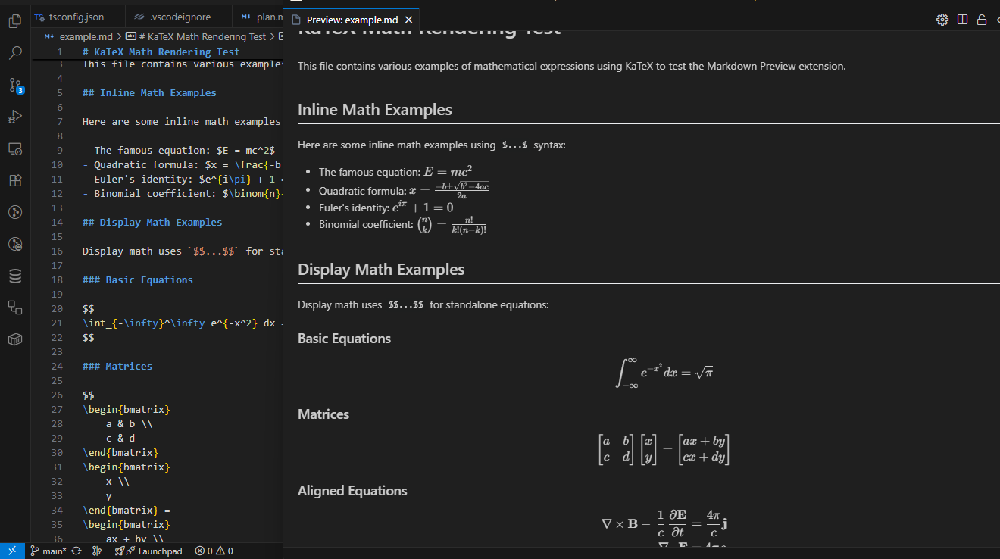

# Enhanced Markdown Preview

This file demonstrates the newly added GitHub Flavored Markdown (GFM) features.

## 1. Front Matter
The YAML block at the top of this file is rendered as a clean table.

## 2. GitHub-Style Alerts
> [!NOTE]
> This is a note alert.

> [!TIP]
> This is a tip alert with a small padding adjustment.

> [!IMPORTANT]
> This is an important alert.

> [!WARNING]
> This is a warning alert.

> [!CAUTION]
> This is a caution alert.

## 3. Task Lists
- [x] Support for GitHub alerts
- [x] Support for footnotes
- [x] Support for front matter
- [ ] Support for Mermaid (Coming soon)

## 4. Footnotes
Here is a reference to a footnote[^1].
And another one for more details[^2].

## 5. Heading IDs
You can link to this section using `#5-heading-ids` in the URL!

## 6. Mathematical Expressions (KaTeX)
The quadratic formula is:
$$x = \frac{-b \pm \sqrt{b^2 - 4ac}}{2a}$$

## 7. Code Highlighting (Hljs)
```typescript
function hello() {
    console.log("Hello, world 🌍!");
}
```

```python
function hello() {
    console.log("Hello, world 👋!");
}
```

```rust
fn main() {
    println!("Hello, world!");
}
```
```diff
- This line got removed
+ This line got added
```

### 8. Tables
| Column 1 | Column 2 | Column 3 |
| -------- | -------- | -------- |
| Row 1    | Row 1    | Row 1    |
| Row 2    | Row 2    | Row 2    |
| Row 3    | Row 3    | Row 3    |

### 9. Images




### 10. Basic Syntax

- **Bold Text**
- *Italic Text*
- `Code Snippet`
- [Link](https://code.visualstudio.com)
- Emojis: 🌍 👋 👌 😎 🚀 🐍 ✅ ❌
- Custom Emoji: :wave: :smile: :heart: :sparkles: :rocket: :snake: :white_check_mark: :x:

## 11. Blockquotes
> This is a blockquote.

---
[^1]: This is the first footnote.
[^2]: Footnotes are useful for detailed explanations without cluttering the main text.
